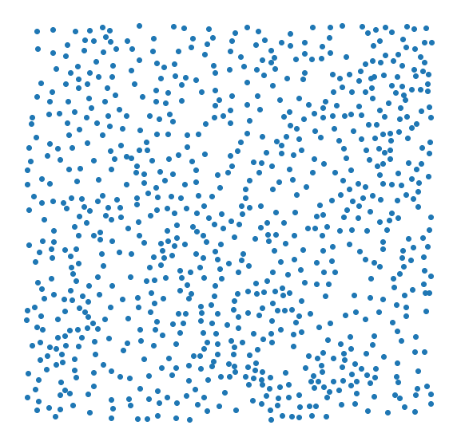
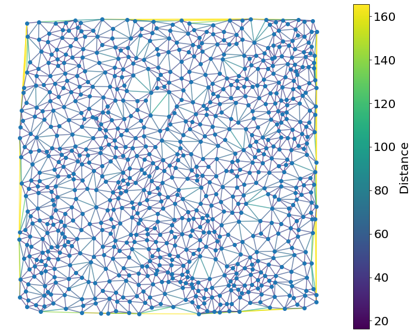
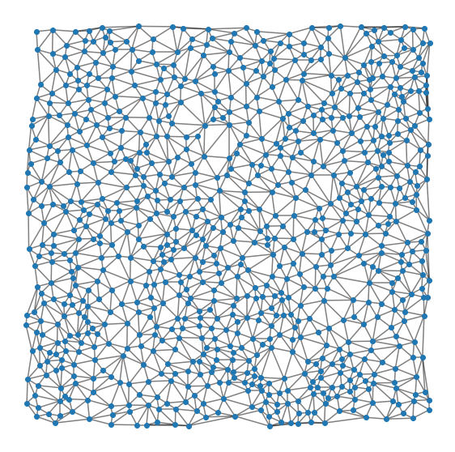
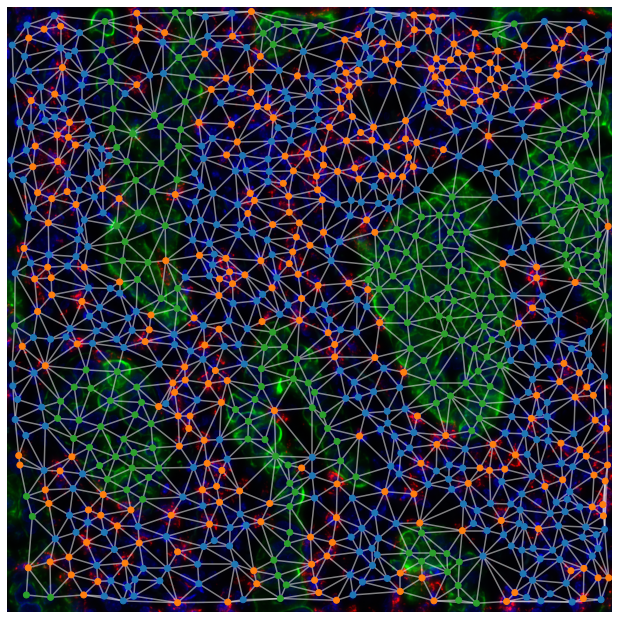
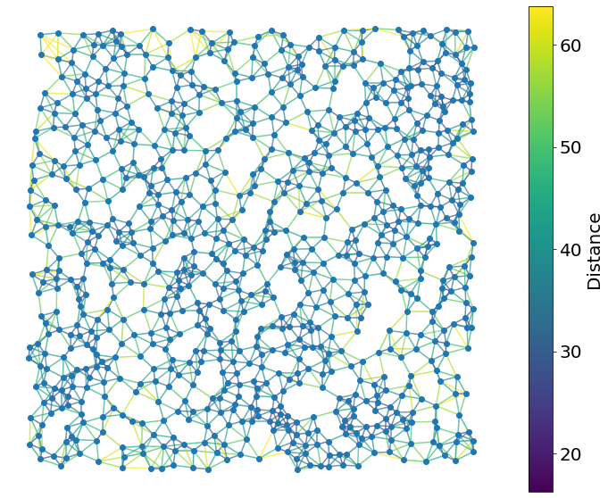
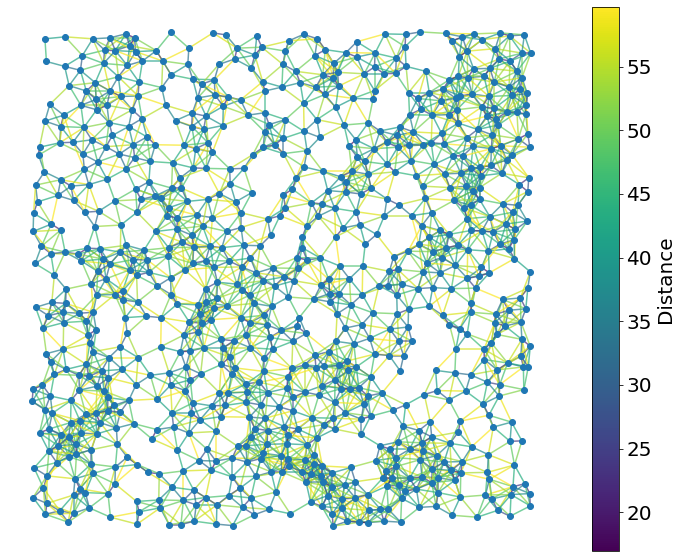
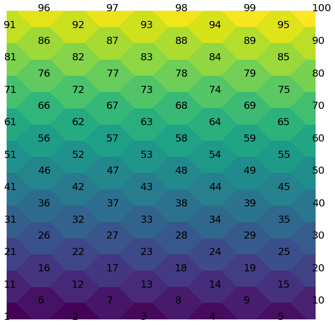
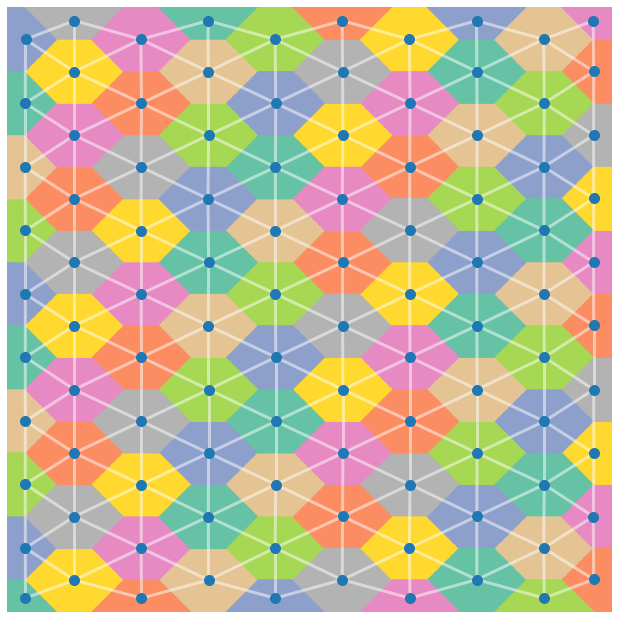

# tysserand

A library for fast spatial network reconstruction.  

*tysserand* is a Python library to reconstruct spatial networks from spatially resolved omics experiments. It is intended as a common tool where the bioinformatics community can add new methods to reconstruct networks, choose appropriate parameters, clean resulting networks and pipe data to other libraries.  
You can find the preprint and supplementary information on [BioRxiv](https://www.biorxiv.org/content/10.1101/2020.11.16.385377v1).  
A turorial is available [here](./examples/02-tutorial.ipynb)

## Implemented methods

### Delaunay triangulation

This methods builds virtual cells centered arround each node and contacting each other to fully tile the space occupyied by the nodes. Edges are drawn between the nodes of contacting tiles.

### k-nearest neighbors

Each node is linked with its k nearest neighbors. It is the most common method used in single cell publications, althought it produces artifact well visible on simple 2D networks.

### radial distance neighbors

Each node is linked to nodes closer than a threshold distance D, that is to say each node is linked to all nodes in a circle of radius D.

### Area contact

Nodes are the center of detected objects (like after cell segmentation) and they are linked if their respective areas are in contact or closer than a given distance threshold.

