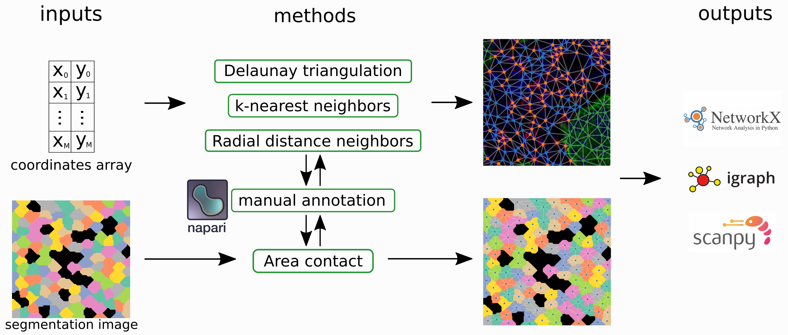

# tysserand

Fast and accurate spatial networks reconstruction.



*tysserand* is a Python library to reconstruct spatial networks from spatially resolved omics experiments. It is intended as a common tool where the bioinformatics community can add new methods to reconstruct networks, choose appropriate parameters, clean resulting networks and pipe data to other libraries.  
You can find the article and supplementary information on [Bioinformatics](https://doi.org/10.1093/bioinformatics/btab490), and the freely available preprint (same text!) is on [BioRxiv](https://www.biorxiv.org/content/10.1101/2020.11.16.385377v2).  
A turorial is available [here](./examples/02-tutorial.ipynb)

*tysserand* is fast: it is 50 to more than 120 times faster than PySAL.  
*tysserand* is accurate: it implements the best performing methods, tested on simulated and real bioimages.
*tysserand* is user friendly and interactive: it integrates tools to choose appropriate parameters and facilitates the use of napari-based interactive image visualization and network annotation.
*tysserand* is modular and opened to contributions: if you have an idea on how to improve reconstruction methods, create a particular one for a specific case, or make them even faster, join us!

## Installation

Simply do
```bash
pip install tysserand
```
If you want the latest features not published on PyPI run
```bash
pip install git+https://github.com/VeraPancaldiLab/tysserand.git
```

It is best practice to create a dedicated environment for each project.
To do it with pyenv:
```bash
# create environment
pyenv install 3.8.10
pyenv virtualenv 3.8.10 spatial-networks
# add environment to jupyterlab
pyenv activate spatial-networks
ipython kernel install --user --name=spatial-networks
```
or with Conda and Mamba:
```bash
# create environment
conda install mamba -n base -c conda-forge
mamba env create --file environment.yml
# add environment to jupyterlab
conda activate spatial-networks
ipython kernel install --user --name=spatial-networks
```
If you want to reproduce results in the publication, install also PySAL
```bash
pip install libpysal geopandas fiona shapely pyproj rtree
```


## Implemented methods


### Delaunay triangulation

This method builds virtual cells centered arround each node and contacting each other to fully tile the space occupyied by the nodes. Edges are drawn between the nodes of contacting tiles.

  
  
  

### k-nearest neighbors

Each node is linked with its k nearest neighbors. It is the most common method used in single cell publications, althought it produces artifacts well visible on simple 2D networks.


### radial distance neighbors

Each node is linked to nodes closer than a threshold distance D, that is to say each node is linked to all nodes in a circle of radius D.


### Area contact

Nodes are the center of detected objects (like after cell segmentation) and they are linked if their respective areas are in contact or closer than a given distance threshold.  
A parallelized version is implemented with the Dask library.


### Area contact *and* k-nearest neighbors

Areas are linked if they are in contact or closer than a given distance. Then, the remaining non connected areas are connected with their nearest neighbors.
